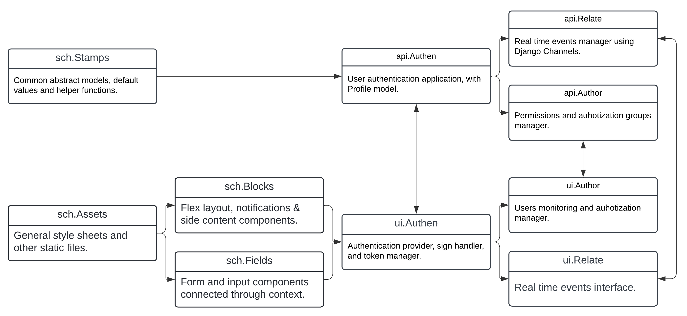

# 🌐 A Full-Stack Web Developer.

In Alexandria, Egypt, before earning a bachelor degree in accounting, I faced a roadblock in pursuing my dream of joining a computer science university. Undeterred, I embraced the challenge as an opportunity to carve my own path. From grappling with Java, C and to mastering HTML, CSS with PHP to finally JavaScript, and Python, I evolved into **a full-stack web developer**. My journey didn't stop there; I delved into **Django (DRF)** and **React**, choosing them as the cornerstones for my future projects. Every setback fueled my passion, turning each line of code into a testament to my dedication. The story is far from over—my thirst for knowledge and the thrill of constant learning continue to propel me forward on this enchanting journey.

## ✨ Why I Chose Web Development.

Web technologies, encompassing websites and web applications, are pivotal due to their global accessibility, enabling users worldwide to connect effortlessly. Their convenience, scalability, and cost-effectiveness make them indispensable, allowing seamless access across diverse devices and platforms while fostering engagement through interactive features. Additionally, web technologies encourage innovation and flexibility, driving continuous improvement and collaboration within the development community. With their inherent cross-platform compatibility and emphasis on accessibility, they facilitate inclusivity and ensure equitable access to information and services, shaping modern communication, commerce, education, and entertainment paradigms.

## 💰 Web Development Market Size.

The global web development market size was **USD 56,000,000,000 (56 Thousand Million US Dollars)** in **2021**. As per [**Business Research INSIGHTS**](https://www.businessresearchinsights.com/market-reports/web-development-market-109039), the market is expected to reach **USD 89,013,000,000 (89 Thousand Million)** by **2027**, exhibiting a compound annual growth rate of 8.03% during the forecast period.

## 🧠 Scheme.

**Scheme** is my foundation upon which I construct web projects, based on Python (Django/DRF) for the back-end and JavaScript (React/Vite) for the front-end, alongside with Bash scripts to automate general project tasks.

